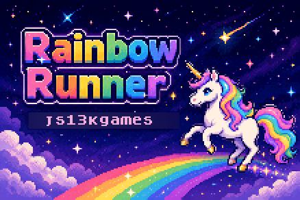
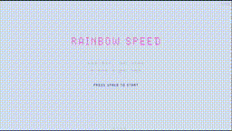

# Rainbow Rider



A [js13kgames 2026](https://js13kgames.com/) entry for the theme **"Unicorns and Rainbows"**.

Leap from cloud to cloud as a unicorn, weaving an unbroken rainbow trail. Dodge obstacles, grow stronger, and reach the goal while keeping your rainbow alive.

## Gameplay



## How to Play

### PC

- **Arrow keys** — Move left / right
- **Space** — Jump
- **M** — Toggle mute
- **B** — Show scoreboard (title screen)

### Mobile

- **Tap left side** — Move left
- **Tap right side** — Move right
- **Tap both sides** — Jump
- **Tap top-right** — Toggle mute

## Data Storage

Best clear times (top 5) are saved to `localStorage` under the key `rainbowrider:t`.

## Getting Started

```bash
bun install
bun run dev     # development server
bun run build   # production build
bun run zip     # create zip and check size
```

## File Size

- **Limit:** 13,312 bytes (13 KB)
- **Current:** 13,298 bytes

## Tech Stack

- Vite + TypeScript
- Canvas 2D API
- Terser (minification)

## Credits

- [Flyable Heart](https://flyableheart.com/) — author
- [ZzFX](https://github.com/KilledByAPixel/ZzFX) v1.3.2 by Frank Force (MIT) — sound effects
- Dogica Pixel font by Roberto Mocci — bitmap font generation
- Built with [Claude Code](https://claude.ai/code) by Anthropic
